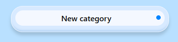
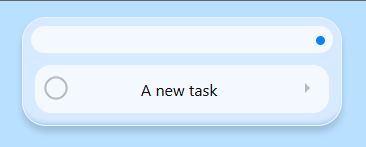
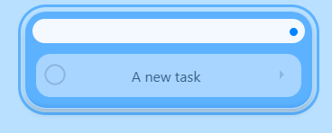
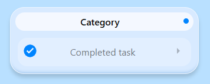
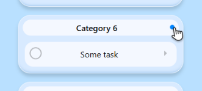
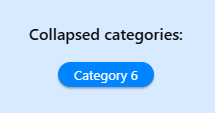

# Try it [via this link](https://help-yourselfes.github.io/to-do-list-JS/index.html)
# Overview
This is basic todo-list
It dont have mobile-version yet
I'm too lazy to style constructor-bar
Has unoptimised save-load functionality
# What can it do?
You can create:
- categories
 
- and tasks
 
Obviously, you can delete them too:
 
 
Of course, you can mark your tasks as completed:
 

If you have a lot of categories, you can collapse them by pressing on the corner:
 
 They will be shown in the 'collapsed categories' bar:
 
 A category returns to the task list when you tap on its bubble.
